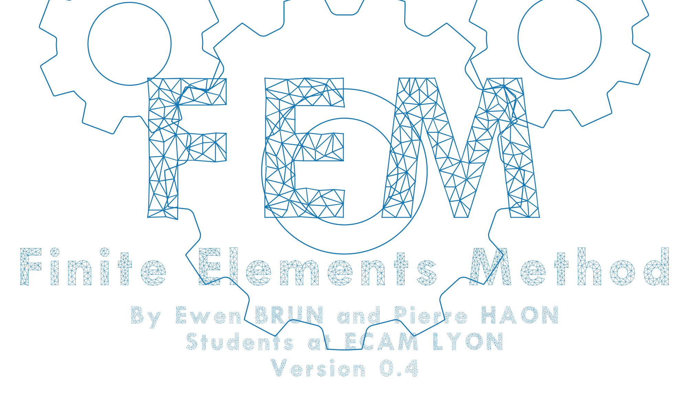
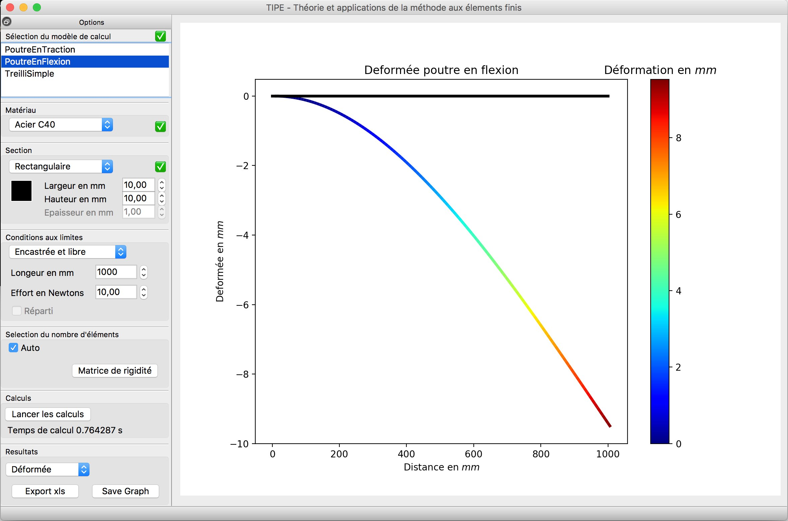

# FEM
### *Finite Elements Analysis applied to static*




### Purpose

The purpose of this code is first academic. It's to explain simply how industrial codes do work.



### Requirements

Your computer must have more than 2GB of RAM and verify one of the specifications bellow.

- Anaconda Python3.6


### Installation


##### Linux and macOS

```bash
git clone https://github.com/N0n3Typ3/FEM.git
cd FEM
./run
```

##### Windows

Clone the repo and click ```run.bat```
